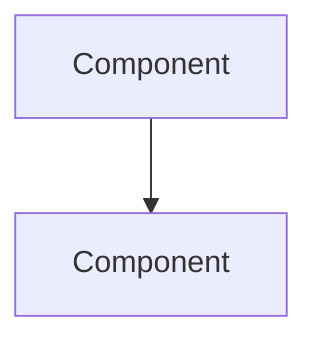

# Design: <Feature Name>

## 1. Technical Overview

**What:** <brief description>
**Why:** <technical motivation, not business justification>
**Scope:** <included vs excluded>

## 2. Architecture Impact

<affected components, with full file paths>

## 3. Technical Decisions

| Decision | Chosen Approach | Alternative Considered | Trade-off |
|---|---|---|---|

## 4. Component Overview

**<Layer>:**

| File Path | New/Modified | Purpose | Key Responsibilities |
|---|---|---|---|

## 5. API Contracts

<omit this section for trivial/simple features with no API surface>

### <Method> <Path>
**Authentication:** <...>

**Request:**

| Field | Type | Required | Validation | Description |
|---|---|---|---|---|

**Response (Success - <status>):**

| Field | Type | Description |
|---|---|---|

**Error Codes:**

| Code | HTTP Status | Description |
|---|---|---|

## 6. Data Model

<omit this section when there's no schema change>

### Table: `<name>`

| Column | Type | Nullable | Default | Description |
|---|---|---|---|---|

**Indexes:**

| Index Name | Columns | Type | Purpose |
|---|---|---|---|

## 7. Testing Strategy

| Test File | Test Type | Target | Coverage Goal |
|---|---|---|---|

| Test Function | Description | Assertions |
|---|---|---|
