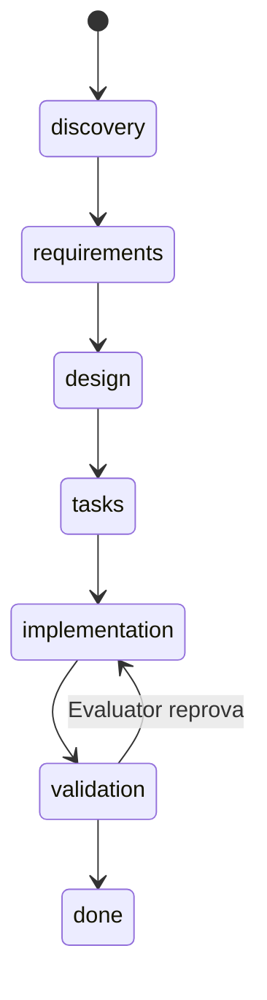

# Arquitetura do sdd-framework-fullcast

> Documento de design (meta-PRD do próprio framework). Nada aqui foi implementado ainda — este
> arquivo alinha decisões antes de criar qualquer skill, template ou schema.
> v3: portabilidade multi-agente, papel de Evaluator, lock de metodologia por feature, guidelines por
> stack, personas do Aranhaverso, relatórios em 3 níveis (task/feature/projeto), heurística de
> tokens v1.
> v4: Gates de qualidade (§8), `context_project.md` (§11), revisão crítica final — `state.json`
> ganha `real_difficulty`/`tokens_estimated`, `config.yaml` consolidado, gaps sinalizados em §16
> (Batch Mode, Foundation Features, versionamento de `.fullcast/` no git).
> v5: `contract.md` (§7) — terceiro artefato do `tech-lead`, contrato de comportamento com gate de
> cobertura de AC; unifica com Gates (§8) e `context_project.md` (§11) em vez de duplicar conceito.
> v6: Fase 1 implementada — as 7 skills, scripts, schemas e guidelines existem de verdade em
> `.agents/skills/`, `guidelines/`, `schema/` (symlinked em `.claude/skills/`). 3 itens do §16
> resolvidos na implementação (Foundation Features, versionamento de `.fullcast/` no git,
> cache de comando de Gate) — ver §16 para o que ainda ficou em aberto.
> v7: Human-in-the-loop (§15) — aprovação humana explícita em cada transição de estágio,
> obrigatória por padrão (`config.yaml: human_in_the_loop`), separada dos Gates de qualidade
> (julgamento humano vs. ferramenta automática). Descoberta rodando o exemplo `wordcount`
> end-to-end: o pipeline original rodava autônomo do início ao fim sem nenhum checkpoint.
> v8: `.fullcast/` reorganizado por papel (`pm/`, `features/<id>/{tech-lead,developer,evaluator}/`
> — §12) em vez de por tipo de arquivo, porque ficava difícil ver quem produziu o quê. Tasks
> ganham campo `phase` no `state.json` e nos relatórios do developer (§13) — as fases que o
> tech-lead define em `tasks.md` desapareciam assim que a execução começava.
> v9: rodado um segundo exemplo (`examples2`, Todo CRUD com HTTP API) com HiTL ligado de
> verdade — achado e corrigido um gap real: `contract.md` nunca exigia um item de "ambiente
> fresco" pra feature com persistência em disco, então um bug (diretório não criado) passou
> por todos os Gates e pelo Evaluator (§16 documenta por quê — nenhum dos dois tinha como pegar).
> Regra nova em `contract-rules.md`: toda feature com persistência em disco precisa de pelo
> menos um item de ambiente fresco. Política de bug pós-`done` também resolvida (§16): não
> reabre, corrige direto com commit explícito.
> v10: renomeado `qa` → `evaluator` em todo o framework. Três adições, todas do `developer`
> fazendo passada diferente (não papel novo): lock de execução por PID (§18, evita duas
> execuções concorrentes na mesma feature/projeto), execução recomendada como subagente por
> papel (§17), `fullcast-developer-codereview` (§20) fechando o gap de code review real
> (nada consultava `guidelines/*.md` até agora) e `fullcast-developer-fix-runner` (§19)
> pra correção cirúrgica pós-reprovação do `evaluator`, com HiTL obrigatório em cada ciclo.
> v11: regra de prioridade explícita (§11) — `context_project.md` populado manda; greenfield
> vazio, quem manda é o que o usuário disser (inclusive estilo de arquitetura, ex.: Clean
> Architecture), e essa resposta vira a próxima entrada autoritativa. Nova seção
> "Architecture" no `context_project.md`, pergunta própria no bootstrap do `tech-lead` (não
> mais escondida em "folder structure"). `guidelines/` esclarecido: já era aberto (carrega
> tudo que existir na pasta do stack, não um schema fixo de 5 arquivos) — só não estava
> explícito; exemplo de `nextjs/` mostra categorias extras (`component-patterns.md`,
> `accessibility.md`, `state-management.md`) que Go/Java não têm e não precisam ter.
> v12: guidance de stack deixa de ser só `guidelines/<stack>/*.md` escrito à mão — vira
> resolvido, por padrão, a partir de uma Agent Skill instalada `<primary_language>-pro` (ex.:
> `golang-pro`, movida de `exemplos/` pra `.agents/skills/stack/`, com symlink de referência em
> `.agents/skills/`), usada exatamente como instalada.
> `guidelines/<primary_language>/` continua existindo como opção — só passa a ser o caminho
> explicitamente customizado (`stack.guidance_source: guidelines`), não mais o default nem algo
> que o framework mantém pronto por stack. `guidelines/go/` foi removido; os 5 arquivos
> compartilhados da raiz continuam valendo sempre, independente da fonte escolhida.
> v13: terceiro nível de hierarquia acima de feature — **initiative** (§21), `I01`/`I02`...,
> `.fullcast/<id>-slug/{pm,features/<id>/...}`. Uma por ciclo de PRD do `pm` por
> padrão (fallback: `tech-lead` cria se um PRD chegar sem passar pelo `pm`). Branch por
> initiative vira **sugestão** (nunca automática, `config.yaml: git.suggest_branch`); worktree
> (`isolation: "worktree"` da Agent tool) vira **obrigatório** em toda invocação de papel como
> subagente (§17), não só quando há paralelismo. Ao fechar a última feature de uma initiative,
> `evaluator` pergunta se quer gerar `changesfullcast/<data>-<id>-<slug>.md` (skill nova
> `fullcast-changes`, §21.4) — resumo na raiz do projeto, fora de `.fullcast/`,
> papel equivalente ao `archive/` do OpenSpec. `state.json` ganha `initiatives[]` e
> `features[].initiative_id`; o antigo `artifacts` de projeto (brief/PRD soltos) é descontinuado
> a favor de `initiatives[].artifacts` (§13).
> v14: dois achados testando de verdade (instalação + `fullcast-init` num projeto zerado, via
> Codex). Bug: o `context_project.md` que `init.sh` escrevia era hardcoded em inglês mesmo com
> `--language pt-BR` — só `config.yaml` respeitava o idioma. Corrigido: os dois arquivos, no
> idioma escolhido. Gap: `fullcast-init` perguntava pouco e silenciosamente assumia `en`/`go`
> quando nada respondia — vira entrevista de verdade (mesmo padrão do `fullcast-pm`, uma
> pergunta por vez), **sempre**, código existente ou não — o que muda com código presente é a
> forma da pergunta (confirma o que foi detectado via `go.mod`/`package.json`/etc. em vez de
> perguntar às cegas), nunca se ela é feita. Novo `--project-type` no `init.sh` e
> `fullcast-init/references/bootstrap-interview.md` com o detalhe.

## 1. Objetivo

Framework de Spec-Driven Development (SDD) que:

- Tem uma **máquina de estado canônica** única controlando em que etapa cada feature está.
- Usa **uma metodologia própria** (`fullcast`), merge deliberado de BMAD e OpenSpec.
- **Não é exclusivo do Claude Code** — as skills precisam funcionar também em Codex, GitHub
  Copilot e outros agentes de codificação (§2).
- É configurável por projeto: idioma (`en`/`pt-BR`), tudo dentro de **`.fullcast/`** no
  repo de destino.
- Nasce com foco em Go, com guidelines organizadas por stack + um conjunto compartilhado (§5).
- Exige **aprovação humana explícita** em cada transição de estágio — nenhum artefato avança
  pro próximo papel sem sign-off do usuário, por padrão (§15).
- Captura o contexto de engenharia do projeto uma vez, em `context_project.md` na raiz, e
  reaproveita entre metodologias e features (§11) em vez de redescobrir a cada feature.
- Roda uma pipeline de **Gates de qualidade** (compilação, lint, dependências/arquitetura,
  script próprio do projeto, testes, código morto) antes de qualquer feature virar `done` (§8).
- Gera relatórios em 3 níveis — task, feature e projeto (§10).

Sem CLI/binário próprio: o motor é Markdown (skills) + JSON de estado.

## 2. Portabilidade entre agentes (Claude Code, Codex, Copilot, ...)

Nesta própria sessão você instalou a skill `grill-me` via `npx skills add` e ela chegou como
"universal: Codex, Cursor, GitHub Copilot, OpenCode, Amp +12 more" — o conteúdo canônico ficou em
`.agents/skills/grill-me/SKILL.md`, com um symlink `.claude/skills/grill-me` apontando pra ele e
um arquivo opcional `agents/openai.yaml` com metadados específicos daquele runtime. Vamos adotar
exatamente essa convenção em vez de inventar a nossa:

- **Fonte canônica:** `.agents/skills/<nome-da-skill>/SKILL.md`, uma pasta por skill (cada papel
  vira uma skill própria: `fullcast-pm`, `fullcast-tech-lead`, `fullcast-developer`,
  `fullcast-evaluator`, mais as `core` — §4).
- **Conteúdo agnóstico de ferramenta:** o corpo de cada `SKILL.md` é escrito em instrução
  simples — "leia o arquivo X", "rode `git diff`", "escreva Y" — nunca referenciando nomes de
  tools específicos do Claude Code (nada de "use a tool Read"). Qualquer agente que leia/escreva
  arquivo e rode shell consegue seguir. Isso cobre Codex e Copilot sem eu precisar adivinhar a
  API interna de cada um.
- **Adaptação por ferramenta, quando necessário:** arquivos `agents/<tool>.yaml` dentro da pasta
  da skill, só quando aquele runtime específico precisar de metadado extra (política de
  invocação, nome de exibição) — mesmo padrão do `agents/openai.yaml` do grill-me.
- **Instalação no Claude Code:** symlink `.claude/skills/<nome>` → `.agents/skills/<nome>`
  (o que o instalador já faz automaticamente).
- **Limitação honesta:** não tenho como testar de fato dentro do Codex CLI ou do Copilot a partir
  daqui. A convenção de pasta/arquivo eu replico com confiança (já vimos funcionando nesta
  sessão); o comportamento real dentro de cada ferramenta terceira fica para validar quando vocês
  rodarem lá — se algo não for reconhecido, ajustamos o `SKILL.md` daquele papel especificamente,
  sem mudar a estrutura geral.

### 2.1 Instalação num projeto novo

`install.sh` (raiz deste repo) faz a instalação num comando só — ver `README.md` pro passo a
passo objetivo. Recebe o caminho do projeto de destino (existente ou ainda inexistente) e:

1. Copia `.agents/skills/fullcast-*` (as 10 skills de papel/utilitário) e
   `.agents/skills/stack/` (skills de linguagem, ex. `golang-pro`, §5.2) pro
   `.agents/skills/` do projeto de destino.
2. Copia `guidelines/` (os 5 compartilhados; `guidelines/<stack>/` não é copiado — é o caminho
   customizado, §5.2, quem quiser usar em vez de uma skill escreve à mão no destino).
3. Cria os symlinks de referência em `.claude/skills/` — um por skill copiada, mais
   `.claude/skills/stack` apontando pra `.agents/skills/stack` (mesmo padrão descrito acima e em
   §5.2; sem eles o Claude Code não descobre as skills).
4. Copia `schema/` (documentação de referência pro modelo consultar antes de editar
   config/state à mão — não é lido por nenhuma skill em runtime, mas é pequeno e útil).

Depois de rodar o script, falta só um passo manual: rodar `fullcast-init` dentro do projeto de
destino (via Claude Code) — cria `.fullcast/` e `context_project.md` na raiz dele. O script nunca
toca nisso, só nos arquivos do framework em si — reflete a mesma separação de sempre entre
"framework instalado" e "estado do projeto" (§12).

Seguro rodar de novo — sobrescreve só os arquivos do framework, nunca `.fullcast/` nem o código
do projeto.

## 3. Merge BMAD + OpenSpec — de onde vem cada peça

| Ideia | Origem | Como entra no `fullcast` |
|---|---|---|
| Papéis com responsabilidade clara | BMAD (Analyst/PM/Architect/SM/Dev/QA) | 4 papéis (§4): PM, Tech Lead, Developer, Evaluator |
| PRD único com problema/oportunidade | BMAD (PM) | Cobre o "porquê" do `proposal.md` do OpenSpec — não duplicamos esse artefato |
| `design.md` + `tasks.md` por feature | OpenSpec (`design.md`, `tasks.md` por change) | Substitui `spec.md`/`plan.md` dos exemplogs |
| `specs/` como fonte viva da verdade | OpenSpec | `state.json` + `design.md` de features `done` cumprem esse papel |
| Sharding em stories/tasks rastreáveis | BMAD (SM) + OpenSpec (`tasks.md`) | Tasks são objetos no `state.json` com `status` próprio |
| Evaluator como papel dedicado | BMAD (QA) | Estágio `validation` vira responsabilidade do papel Evaluator, separado do Developer |
| Contrato de comportamento testável, com gate de cobertura | Nenhum dos dois — acréscimo próprio (§7) | `contract.md`, terceiro artefato do `tech-lead`; checklist compartilhado entre Developer e Evaluator |

## 4. Papéis — personas do Aranhaverso

Escolhi **Homem-Aranha no Aranhaverso** (não a trilogia clássica) porque é o único filme com
vários Aranhas, cada um com uma personalidade nítida — encaixa bem com múltiplos papéis
especializados. O nome do personagem é só **flavor** (tom de voz do `SKILL.md`, textos de log);
o **identificador técnico** é sempre o nome funcional em inglês, porque precisa ser lido por
qualquer agente (§2), não só por quem pegou a referência do filme.

| Papel (id técnico) | Persona (flavor) | Por quê | Estágios | Produz |
|---|---|---|---|---|
| `pm` | **Miguel O'Hara** | Guardião do "canônico" — define o que precisa ser verdade (requisitos) | `discovery`, `requirements` | `<initiative>/pm/brief.md`, `<initiative>/pm/prd.md` (§21) |
| `tech-lead` | **Peter B. Parker** | O mentor experiente que transforma visão em plano técnico concreto | `design`, `tasks` | `<initiative>/features/<id>/tech-lead/{design,tasks,contract}.md` (§7) |
| `developer` | **Miles Morales** | Quem efetivamente dá o "salto de fé" e constrói | `implementation` | código, commits (1 por task), micro-relatórios por task |
| `evaluator` | **Gwen Stacy** | Olhar de fora, precisão, encontra o que quebra antes de "canonizar" como pronto | `validation` | re-checagem de critérios de aceite, aprova ou devolve pro Developer |

Evaluator vira papel próprio agora (não embutido no Developer): `developer` entrega e roda os 6 Gates de
qualidade (§8) por task e no repo inteiro, mas a **decisão de fechar a feature como `done`** é do
`evaluator`, que só começa depois dos Gates verdes e roda uma re-checagem independente dos critérios de
aceite (equivalente ao Step 6 do `implement-feature` original, só que como um papel/skill
separado). Se falhar, `evaluator` devolve a feature pro estágio `implementation` com a lista do que
falhou — o próprio ciclo que já existia no diagrama de estados
(`validation --> implementation: regressão encontrada`).

Dois papéis adicionais **não fazem** parte deste ciclo principal — são o `developer` (Miles
Morales) fazendo passadas diferentes, sem persona nova: `fullcast-developer-codereview`
(§20) roda entre os Gates e o handoff, revisando qualidade de código contra `guidelines/*.md`
(algo que nem os Gates nem o `evaluator` fazem — ver §20 pra entender por quê); e
`fullcast-developer-fix-runner` (§19), que entra quando `evaluator` reprova, fazendo a
correção cirúrgica só dos itens que falharam em vez de reprocessar `tasks.md` inteiro de novo.

## 5. Estrutura do framework (este repo)

Revisão: eu tinha exagerado na quantidade de scripts. Regra que fica valendo daqui pra frente:

> **Script só quando (a) mexe em algo externo/irreversível (git, filesystem em massa), ou
> (b) é um algoritmo não-trivial onde errar é caro (grafo, contagem exata de bytes).** Ler ou
> editar um campo de um JSON pequeno, somar dois números, ou incrementar um contador de ID é mais
> rápido e mais simples feito direto pelo modelo (Read/Edit) do que orquestrando um script pra
> isso — orquestrar o script custaria mais do que faz economizar.

Aplicando essa regra: **removidos** `state_get`/`state_update` (ler e editar `state.json` — o
modelo faz direto com Read/Edit, o arquivo é pequeno), `new_feature_id` (incrementar `F0N` é
trivial de olhar e somar 1), `validate_state` (inspeção direta ao ler o arquivo já é suficiente) e
`rollup_report` (o modelo já está lendo os relatórios de task pra escrever o resumo da feature;
somar os números ali mesmo não pede um script à parte).

**Mantidos**, com justificativa por que cada um passa no critério acima:

| Script | Skill dona | Por quê é script |
|---|---|---|
| `init.sh` | `fullcast-init` | Cria `.fullcast/` (pastas, `config.yaml`, `state.json` inicial) — mexe no filesystem em bloco, quer ser idempotente e não deixar o projeto pela metade se falhar no meio |
| `commit.sh` | `fullcast-developer` | Git é externo e o resultado fica no histórico pra sempre — `git add <arquivos específicos> && git commit` sempre da mesma forma, sem depender do modelo lembrar de não usar `git add -A` |
| `compute_waves.py` | `fullcast-pm` | Ordenação topológica + detecção de ciclo no grafo de dependências do PRD — algoritmo, não é "olhar e somar 1" |
| `estimate_tokens.sh` | `fullcast-developer` | Contagem exata de bytes (`wc -c`) — modelo contando caractere é impreciso e caro à toa |

Nenhum script é compartilhado entre skills — cada um vive dentro da skill que o usa
(`fullcast-X/scripts/`), sem uma pasta `_lib/` central. Sem operação genuinamente comum a
todas as 7 skills sobrando, essa camada extra de indireção não se paga.

```
sdd-framework-fullcast/
├── docs/
│   └── architecture.md
├── .agents/
│   └── skills/
│       ├── fullcast-init/
│       │   ├── SKILL.md
│       │   └── scripts/
│       │       └── init.sh
│       ├── fullcast-status/
│       │   └── SKILL.md
│       ├── fullcast-set-methodology/
│       │   └── SKILL.md                    # ver §9 — nome trocado de "switch"
│       ├── fullcast-pm/
│       │   ├── SKILL.md
│       │   ├── scripts/
│       │   │   └── compute_waves.py
│       │   ├── references/
│       │   │   └── prd-sections.md         # as 9 seções detalhadas (hoje dentro do SKILL.md)
│       │   └── assets/
│       │       └── brief-template.md
│       ├── fullcast-tech-lead/
│       │   ├── SKILL.md
│       │   ├── references/
│       │   │   ├── design-and-tasks-rules.md
│       │   │   └── contract-rules.md       # o template completo que você trouxe (§7), adaptado
│       │   └── assets/
│       │       ├── design-template.md
│       │       ├── tasks-template.md
│       │       └── contract-template.md
│       ├── fullcast-developer/
│       │   ├── SKILL.md
│       │   ├── scripts/
│       │   │   ├── commit.sh
│       │   │   └── estimate_tokens.sh
│       │   └── assets/
│       │       └── task-report-template.md
│       └── fullcast-evaluator/
│           ├── SKILL.md
│           └── references/
│               └── evaluation-checklist.md
├── guidelines/                     # só os 5 compartilhados — stack-agnóstico, carrega sempre
│   ├── solid-principles.md        # compartilhado DE VERDADE — conceito de design, não sintaxe
│   ├── anti-patterns.md           # compartilhado: só os universais (god object, número mágico, copy-paste, otimização prematura)
│   ├── testing.md                 # compartilhado: filosofia só (pirâmide de teste, o que mockar, arrange-act-assert) — zero nome de ferramenta
│   ├── naming-conventions.md      # compartilhado: só o preâmbulo universal (consistência, nome com significado, sem abreviação)
│   ├── error-handling.md          # compartilhado: só a filosofia (falhar rápido, nunca engolir erro, logar com contexto)
│   └── <primary_language>/         # OPCIONAL — só existe quando um projeto escolhe
│                                    # `stack.guidance_source: guidelines` em vez de uma skill
│                                    # (§5.2). Não é mais mantido/populado pelo framework.
├── .agents/skills/
│   ├── stack/                      # skills de linguagem/stack agrupadas, separadas das
│   │   │                            # fullcast-* — todo *-pro futuro (java-pro, nextjs-pro)
│   │   │                            # mora aqui, conteúdo real
│   │   └── golang-pro/              # a fonte concreta de guidance pra Go, por padrão (§5.2) —
│   │       ├── SKILL.md             # skill de terceiro (github.com/Jeffallan), usada como está,
│   │       └── references/          # sem edição do framework: concurrency, generics, interfaces,
│   │                                 # testing, project-structure
│   ├── golang-pro -> stack/golang-pro   # symlink de referência — Claude Code só descobre
│   │                                       # skill em .agents/skills/<nome>/, não em subpasta
│   └── fullcast-*/              # as skills do próprio framework (ver árvore completa acima)
└── .claude/skills/                   # espelha .agents/skills/ inteiro via symlink, nos dois
                                       # níveis: .claude/skills/stack -> ../../.agents/skills/stack
                                       # (organização) e .claude/skills/golang-pro ->
                                       # ../../.agents/skills/golang-pro (o que o Claude Code
                                       # efetivamente escaneia)
├── schema/                         # documentação da forma do state/config — não é validado
│   ├── config.schema.json          # por script; é referência pro modelo ler antes de editar
│   └── state.schema.json
└── templates/
```

`error-handling.md` e `naming-conventions.md` **não são majoritariamente compartilháveis** — Go
trata erro como valor de retorno (sem exceção), Java tem checked/unchecked exception, JS tem
try/catch + rejeição de Promise; nomenclatura idiomática de Go (`MixedCaps`, sem `Get` prefixo, sem
stutter de pacote) não tem nada a ver com a de Java (`PascalCase` de classe, nomes descritivos
longos). Por isso o arquivo da raiz, pra esses dois casos, fica **fino de propósito** — só a
filosofia que atravessa qualquer stack — e a regra concreta vem de fora (ver 5.2). Já
`solid-principles.md` (princípio de design, não sintaxe) e a parte universal de `anti-patterns.md`
(god object, código duplicado, otimização prematura) são conceituais o bastante pra serem
compartilhados de verdade, com conteúdo substancial na raiz. `testing.md` fica no meio: a raiz
cobre filosofia (o que testar, quanto mockar), o concreto (Go: `testify`/stdlib; Java:
JUnit/Mockito) vem de 5.2.

### 5.1 Anatomia de cada skill

Cada skill segue a anatomia padrão de Agent Skill (a mesma que a `skill-creator` ensina, e que
vamos usar de fato pra montar cada uma na Fase 1 — não confiar só na minha memória da convenção):

- **`SKILL.md`** — sempre carregado quando a skill é ativada. Fica enxuto: frontmatter
  (`name`, `description`) + o fluxo de passos, sem o detalhe pesado de cada seção.
- **`references/`** — detalhe que hoje está espremido dentro do `SKILL.md` dos exemplogs (ex.: as
  regras das 9 seções do PRD, o checklist de validação) sai pra cá. Só é lido quando o passo
  correspondente do fluxo precisa dele.
- **`scripts/`** — só os 4 da tabela acima. Tudo que envolve ler/editar o `state.json`,
  redação de conteúdo, ou julgamento (entrevista, re-check de critério de aceite) fica com o
  modelo, sem wrapper.
- **`assets/`** — templates literais (esqueleto de `design.md`, `tasks.md`, `brief.md`, relatório
  de task) que a skill copia e preenche, em vez do modelo redigitar a estrutura todavez.

### 5.2 De onde vem o guidance concreto de cada stack

v8 (ver changelog): deixou de ser `guidelines/<stack>/*.md` mantido à mão pelo framework — passou a
ser **resolvido**, por `.fullcast/config.yaml: stack`:

- **`guidance_source: skill`** (default) — usa a Agent Skill instalada
  `<primary_language>-pro` (`guidance_skill` sobrescreve o nome quando não segue a convenção). A
  skill é lida **exatamente como instalada** — este framework nunca edita o conteúdo dela. Todo
  skill de stack (Go, Java, Next.js, etc.) mora fisicamente em `.agents/skills/stack/<nome>-pro/`
  — pasta própria, separada das `fullcast-*`, pra não misturar "skill do framework" com "skill
  de linguagem". `.agents/skills/<nome>-pro` é só um **symlink de referência** pra dentro de
  `stack/` (necessário porque a convenção de descoberta do Claude Code é flat, um nível só —
  não escaneia subpasta), espelhado em `.claude/skills/<nome>-pro` do mesmo jeito que as
  `fullcast-*` já são. Hoje só existe uma: `golang-pro` (terceiro, github.com/Jeffallan,
  movida de `exemplos/` na v8), cobrindo Go via `SKILL.md` (Core Workflow, Constraints) +
  `references/{concurrency,generics,interfaces,testing,project-structure}.md`. Java/Next.js ainda
  não têm skill equivalente instalada — usar `guidance_source: guidelines` pra esses até existir
  uma `java-pro`/`nextjs-pro` (que, quando chegar, entra em `stack/` do mesmo jeito).
- **`guidance_source: guidelines`** — volta ao mecanismo antigo: `guidelines/<primary_language>/`
  escrito à mão no próprio projeto. Deixou de vir pronto com o framework (não existe mais
  `guidelines/go/` nem esqueleto pra `java/`/`nextjs/`) — é o caminho **customizado**, pra quem
  não tem (ou não quer) uma skill `*-pro` pra aquele stack.

Nenhuma skill do framework (`fullcast-tech-lead`, `fullcast-developer`,
`fullcast-developer-codereview`) assume a forma exata do que a skill de stack expõe — leem o
que tiver (`SKILL.md` + `references/`), do mesmo jeito que já liam "o que tiver na pasta" no
mecanismo antigo. O único acoplamento é a convenção de nome (`<primary_language>-pro`) e a
resolução via `config.yaml`. Os 5 compartilhados da raiz **sempre** carregam, com as duas fontes —
eles não competem com o que a skill de stack cobre, complementam.

## 6. Máquina de estado canônica



| Stage | Papel | Artefato |
|---|---|---|
| `discovery` | PM | `<initiative>/pm/brief.md` (§21) |
| `requirements` | PM | `<initiative>/pm/prd.md` (§21) |
| `design` | Tech Lead | `<initiative>/features/<id>/tech-lead/design.md` |
| `tasks` | Tech Lead | `<initiative>/features/<id>/tech-lead/{tasks,contract}.md` (§7) + tasks no `state.json` |
| `implementation` | Developer | commits (1/task) + `<initiative>/features/<id>/developer/<task-id>.md` |
| `validation` | Evaluator | percorre `contract.md` (§7); aprova → `done`, ou reprova → volta pro Developer |
| `done` | — | `<initiative>/features/<id>/evaluator/{summary,difficulty,tokens}.md` + `.fullcast/report.md` atualizado |

## 7. Contrato de comportamento (`contract.md`)

Terceiro artefato do `tech-lead`, ao lado de `design.md` e `tasks.md` — não é ideia do BMAD nem do
OpenSpec (nenhum dos dois tem isso), é um acréscimo genuíno que resolve uma lacuna que os dois
deixavam: nenhum garantia, de forma mecânica, que toda AC do PRD tivesse um jeito concreto de ser
verificada antes da feature virar `done`.

**O que é:** especificação de comportamento, agnóstica de stack e de quem vai lê-la (agente ou
humano), organizada por **superfície de verificação** (`## HTTP API`, `## CLI`, `## Service`,
`## UI`, `## Worker`, `## Event`, `## E2E` — cada feature emite só as que se aplicam). Dentro de
cada superfície, itens Given/When/Then com ID estável (`API-LOGIN-01`), agrupados por capability.

**Coverage Manifest + hard gate:** uma tabela mapeia cada AC do PRD (texto verbatim, não um ID
sintético) pros itens que a cobrem. `tech-lead` valida antes de salvar: se alguma AC dentro do
escopo da feature ficar sem item cobrindo, **aborta os três arquivos** (`design.md`, `tasks.md`,
`contract.md` — nenhum fica pela metade). Segue o mesmo princípio semântico do `implement-feature`
original: localizar a AC no PRD pelo conteúdo, nunca por número fixo de seção — o `prd.md` do
nosso `pm` não tem obrigação de numerar igual ao exemplo dos exemplogs.

**Três pontos de integração com o que já existia neste doc, em vez de conceito novo:**

- **Seção "Quality gates" do contrato = §8 (Gates), só que por feature.** Não é uma segunda lista
  de qualidade — é a mesma tabela do §8, filtrada pro que essa feature usa, com o comando já
  resolvido. Resolve o item que eu tinha deixado em aberto (cache do comando de Gate descoberto).
- **Prerequisites (fixtures, seed de dado, mock) lê do `context_project.md` (§11), não redescobre.**
  O template original propõe descobrir convenção de fixture/seed/config/mock por conta própria —
  isso é exatamente o mesmo problema de redescoberta repetida que motivou o `context_project.md`.
  Essas 4 convenções viram mais uma categoria capturada lá (Layer 1/2 discovery do `init`), e o
  `contract.md` só lê.
- **Evaluator para de improvisar a re-checagem de AC.** Em vez de julgamento livre sobre "isso atende o
  critério?", `evaluator` percorre os itens do `contract.md` um a um e marca ✓/✗ — `references/
  evaluation-checklist.md` da skill `evaluator` vira "como interpretar e executar um item do contrato",
  não um checklist genérico.

**Diferença de ciclo de vida em relação ao `context_project.md`:** `contract.md` é gerado e
**read-only** depois — regeneração é por completo (não se edita à mão, não se acrescenta
incrementalmente). É o oposto do `context_project.md`, que é vivo e só recebe adição. Os dois
convivem porque resolvem problemas diferentes: um é conhecimento de projeto que se acumula, o
outro é a promessa testável de uma feature específica, que muda por completo se a PRD mudar.

**Custo, sendo direto:** gerar isso é mais token por feature do que só `design.md`+`tasks.md`. Vale
a pena pelo que resolve (rastreabilidade PRD→teste garantida por gate, checklist compartilhado
entre Developer e Evaluator), mas não é de graça — decisão consciente, não um "grátis" que eu queira
vender.

**Onde fica o conteúdo detalhado:** o template completo (schema de item, catálogo de superfícies,
guard-rails, exemplo trabalhado) que você colou é grande demais pra este documento de arquitetura
— aqui é onde a decisão é registrada, não o manual da skill. Ele vira
`fullcast-tech-lead/references/contract-rules.md` na Fase 1 (§5.1 já previa exatamente esse
uso de `references/`: detalhe pesado, carregado só quando o passo de gerar o contrato precisa
dele), com "spec-writer"/`spec.md`/`plan.md` do texto original traduzidos pra `tech-lead`/
`design.md`/`tasks.md`.

`state.json` ganha um terceiro artefato por feature (ver §13):

```json
"contract": { "path": ".fullcast/I01-cadastro-usuario/features/F01-cadastro-usuario/tech-lead/contract.md", "status": "done" }
```

## 8. Gates de qualidade

Os 6 que você listou, na mesma ordem — a ordem já é a certa (do mais barato/rápido de falhar pro
mais caro/amplo, então nada roda à toa se algo básico já quebrou):

| # | Gate | O que checa | Ferramenta (§5.2: comando declarado na skill de stack, ex. `golang-pro` pra Go, ou em `guidelines/<stack>/gates.md` quando `guidance_source: guidelines`) |
|---|---|---|---|
| 1 | Compilação/contrato | O projeto compila; contratos (schema de API, proto, etc.) são válidos | `go build ./...`, validação de contrato se houver |
| 2 | Lint | Estilo e problemas estáticos | `golangci-lint run` (ESLint é o equivalente em JS/TS — o nome do gate é genérico, a ferramenta é por stack) |
| 3 | Fronteira de dependências/arquitetura | Import indevido entre camadas, ciclo de pacote | equivalente Go ao Dependency Cruiser (ex.: `depguard`, regra de import por camada) |
| 4 | Script próprio do projeto | Qualquer checagem específica daquele projeto que não é genérica de stack | descoberto em runtime (`Makefile`, script em `.fullcast/config.yaml: gates.custom`) |
| 5 | Testes automatizados | Suite de testes passa | `go test ./...` |
| 6 | Código morto/dependências não usadas | Função/import/dependência sem uso | `staticcheck`/`deadcode`, `go mod tidy -diff` |

**Proposta de 7º gate — segurança:** checagem de vulnerabilidade conhecida em dependências
(`govulncheck` pra Go). Não estava na sua lista; incluo como sugestão porque é uma categoria de
falha que nenhum dos 6 cobre (lint/testes não pegam CVE em dependência). Fácil de desativar no
`config.yaml` se vocês não quiserem por agora.

**Semântica de falha:** os Gates reaproveitam o mesmo tri-estado que o `implement-feature` original
já definia — **hard-fail** (bloqueia, retry até o limite configurado), **soft-fail** (ferramenta
não roda nesse ambiente — pula e registra), **falha pré-existente** (já falhava antes desta task,
não conta contra o retry). Não é um mecanismo novo, é o mesmo já usado na Fase 1 do roadmap.

**Quem roda e quando:** `developer` roda os Gates relevantes a cada task (escopo: arquivos
tocados) e roda o conjunto **completo** no repo inteiro antes de considerar a feature pronta pra
Evaluator — mesmas duas passadas que o `implement-feature` original já fazia (por fase, e a validação
final completa). **`evaluator` só começa a re-checagem de critérios de aceite depois que todos os Gates
estão verdes** — se um Gate falha, a feature volta pro Developer sem Evaluator precisar nem olhar os
critérios de aceite ainda. Ou seja: Gates são checagem de **engenharia** (o código está correto/
limpo/seguro); a re-checagem do Evaluator é checagem de **produto** (o comportamento atende o que o PRD
pediu) — as duas são necessárias e não substituem uma à outra.

`config.yaml` registra quais Gates estão ativos (todo Gate desligável, exceto compilação/testes
que são o mínimo pra existir um `done`) — o bloco `gates:` faz parte do mesmo `config.yaml` único
do projeto, mostrado por completo no §12.

## 9. Lock de metodologia por feature

Sua regra: se uma feature começou com OpenSpec (ou BMAD, ou `fullcast`), ela **termina** com
essa mesma metodologia — trocar a metodologia ativa não migra trabalho em andamento.

Implementação: cada feature grava seu próprio `methodology` no `state.json` **no momento em que é
criada** (entrada no estágio `discovery`/`requirements`), imutável depois disso:

```json
{
  "id": "F01",
  "methodology": "fullcast",
  "stage": "tasks",
  ...
}
```

- `config.yaml: methodology` é só o **default para features novas** — não é um interruptor global
  retroativo.
- A skill que eu tinha chamado de `fullcast-switch-methodology` foi renomeada pra
  **`fullcast-set-methodology`**: ela só atualiza esse default. Nunca toca em features
  existentes.
- Cada papel (`pm`, `tech-lead`, `developer`, `evaluator`), ao agir sobre uma feature específica, lê o
  `methodology` **daquela feature** no `state.json` — não o default do config — antes de decidir
  qual conjunto de artefatos/nomenclatura usar. Hoje só existe o pack `fullcast`, então isso é
  uma trava de segurança que já nasce pronta para quando (se) BMAD/OpenSpec puros existirem como
  packs alternativos.
- Uma feature só pode ser marcada `done` pela mesma metodologia que a abriu. Tentar rodar um papel
  de metodologia diferente numa feature em andamento é bloqueado com uma mensagem clara.

## 10. Relatórios — 3 níveis (task, feature, projeto)

Sua observação era: gerar incrementalmente a cada task, e um resumo no final — mas não sabia se o
"final" é por feature ou por projeto. Resposta: **os dois**, porque é a mesma hierarquia que já
existe no `state.json` (task → feature → projeto):

```
.fullcast/
├── report.md                              # nível PROJETO — atualizado a cada feature concluída
└── features/
    └── F01-cadastro-usuario/
        └── report/
            ├── tasks/
            │   ├── F01-T1.md               # nível TASK — criado quando a task termina
            │   └── F01-T2.md
            ├── summary.md                  # nível FEATURE — gerado quando Evaluator aprova (done)
            ├── difficulty.md
            └── tokens.md
```

**Nível task** (`<initiative>/features/<id>/developer/<task-id>.md`, gerado pelo Developer ao terminar cada task):
descrição da task, arquivos tocados, desvios em relação ao `design.md`/`tasks.md`, e a estimativa
de tokens daquela task (§10.1).

**Nível feature** (gerado pelo Evaluator quando aprova a feature como `done`, agregando os relatórios de
task):
- `summary.md` — o que foi implementado, decisões, checklist de critérios de aceite re-checados.
- `difficulty.md` — dificuldade **estimada** pelo Tech Lead (`tasks.md`, escala trivial/simple/
  medium/complex) vs. **real**, derivada do que os relatórios de task mostraram (nº de desvios,
  retries, redesenhos). É esse par que vira sinal de calibração pro board visual depois.
- `tokens.md` — soma das estimativas de todas as tasks da feature (§10.1).

**Nível projeto** (`.fullcast/report.md`, atualizado toda vez que uma feature chega a `done`):
tabela com uma linha por feature (nome, dificuldade estimada/real, tokens estimados, data de
conclusão) + total acumulado do projeto. É o arquivo que dá o resumo executivo de "o PRD inteiro
até aqui".

### 10.1 Estimativa de tokens — v1

Limitação real: nenhuma skill tem acesso programático à contagem exata de tokens da sessão — isso
só existe hoje via `/cost` (leitura manual). Proposta v1, deliberadamente simples e auditável, sem
fator de correção inventado:

```
tokens_estimado(task) = round( (bytes_lidos + bytes_escritos) / 4 )
```

- `bytes_lidos` = tamanho em bytes dos trechos de `design.md`/`tasks.md`/guidelines consultados +
  conteúdo pré-edição dos arquivos tocados nessa task.
- `bytes_escritos` = tamanho em bytes do diff produzido (linhas adicionadas + removidas) + o
  próprio texto do micro-relatório da task.
- `4` = aproximação padrão de caracteres por token em inglês/código (heurística comum, não exata).

Implementado como script (`fullcast-developer/scripts/estimate_tokens.sh`, §5) — `wc -c` e uma divisão, sem
motivo pra passar pelo modelo. Funciona em qualquer agente com shell (§2), sem depender de nenhuma
API do Claude Code. **É deliberadamente um piso, não o total real**: não conta overhead
de conversa, "thinking", tool calls, nem retries. Cada `tokens.md` termina com a linha: *"Estimativa
de conteúdo, não da sessão completa. Para o valor real desta sessão, rode `/cost`."* Sem
multiplicador de calibração por enquanto — se depois vocês compararem algumas estimativas com
`/cost` reais e virem um fator consistente, a gente hardcoda esse fator na v2.

## 11. Contexto do projeto (`context_project.md`)

Item que faltava: um documento que capture o contexto de engenharia do projeto — stack, padrões
de código já em uso, convenções — e que sirva **qualquer metodologia**, não só o pack
`fullcast`. Por isso ele não fica dentro de `.fullcast/` (que é específico do pack): fica
na **raiz do projeto de destino**, visível (sem ponto no nome), ao lado da pasta oculta:

```
<raiz do projeto>/
├── context_project.md
└── .fullcast/
    └── ...
```

**Por que precisa existir:** nos exemplogs, o `spec-writer` refaz a "Codebase Pattern Discovery"
(runtime, framework, banco, auth, API, testes, convenções...) **a cada feature nova** — trabalho
repetido, gastando token de novo em algo que não muda entre uma feature e outra. `context_project.md`
persiste essa descoberta uma vez e vira leitura, não redescoberta.

**Quem lê:** os 4 papéis, sem exceção — PM usa pra não propor requisito incompatível com o que já
existe; Tech Lead usa pra decisões de design consistentes com o padrão do projeto; Developer usa
como as convenções a seguir na implementação; Evaluator usa pra saber qual é o padrão de teste esperado.
Isso vale igual pra qualquer metodologia que atuar sobre o mesmo repo — é por isso que fica fora
de `.fullcast/`.

**Ciclo de vida:**
- Criado por `fullcast-init`: sempre roda uma entrevista curta (idioma, o que está sendo
  construído, tipo de projeto, stack — `fullcast-init/references/bootstrap-interview.md`), código
  existente ou não — nunca assume os defaults do script (`en`/`go`) em silêncio. Com código
  existente, cada pergunta vira confirmação do que foi detectado (`go.mod`, `package.json`, etc.)
  em vez de pergunta às cegas, e ainda roda a descoberta em duas camadas (baseline + ampla, como
  o `spec-writer` original já fazia) uma única vez. O esqueleto escrito reflete as respostas, no
  idioma escolhido, não só `config.yaml`.
- **Documento vivo, não estático:** Tech Lead e Developer podem *acrescentar* uma entrada quando
  descobrem um padrão novo que não estava documentado (ex.: uma convenção de nomenclatura que só
  apareceu na feature 5). Nunca reescrevem o documento inteiro — só complementam, igual o `specs/`
  do OpenSpec funciona como fonte viva.
- Não é validado por script (mesma regra do §5 — é prosa, não estrutura mecânica).

**Regra de prioridade (a que decide quando `context_project.md` e o usuário parecem discordar):**
- **`context_project.md` já populado → ele manda.** Se o projeto tem código e o discovery já
  registrou um padrão (ex.: "erros retornados como valor, nunca panic"), nenhum papel deveria
  ignorar isso em favor de preferência genérica — é o que o código de verdade já faz.
- **Greenfield (`context_project.md` ainda vazio de decisões técnicas) → o que o usuário disser
  manda.** Sem código existente pra descobrir nada, a única fonte de verdade é o que foi pedido —
  inclusive estilo de arquitetura (ex.: "usar Clean Architecture"), não só framework/ORM/auth. É
  exatamente essa pergunta que `fullcast-tech-lead` faz no "empty codebase bootstrap"
  (`design-and-tasks-rules.md` Step 2), e a resposta vira a próxima entrada de
  `context_project.md` — a partir daí, vira o primeiro caso da regra acima pra toda feature
  seguinte. Não se pergunta de novo.

## 12. Arquivos no projeto de destino (visão completa)

Organizado **por papel dentro de cada initiative** (§21) — cada pasta só tem conteúdo de
quem a gerou, então "quem produziu isso" é a própria localização, sem precisar abrir o
arquivo pra saber (motivo: no exemplo `wordcount`, tudo misturado numa pasta `report/`
só ficou difícil de ler de relance quem tinha feito o quê). `pm/` deixou de operar em
nível de projeto (v13) — agora é por initiative, porque um projeto pode ter vários
brief/PRD em paralelo:

```
<raiz do projeto>/
├── context_project.md
├── changesfullcast/                 # §21 — só existe depois que a 1ª initiative fecha
│   └── 2026-09-20-I01-cadastro-usuario.md
└── .fullcast/
    ├── config.yaml
    ├── state.json
    ├── report.md                    # rollup de projeto — não é de um papel só, fica na raiz
    └── I01-cadastro-usuario/         # uma pasta por initiative, direto na raiz de .fullcast/
        ├── pm/
        │   ├── brief.md
        │   └── prd.md
        └── features/
            └── F01-cadastro-usuario/
                ├── tech-lead/
                │   ├── design.md
                │   ├── tasks.md
                │   └── contract.md
                ├── developer/
                │   ├── F01-T1.md
                │   └── F01-T2.md
                └── evaluator/
                    ├── summary.md
                    ├── difficulty.md
                    └── tokens.md
```

Nem `guidelines/` nem a skill de stack são copiados pra dentro de `.fullcast/` — ficam
referenciados a partir do framework instalado (`.agents/skills/`, `guidelines/`, ou caminho
equivalente conforme a ferramenta), pra evitar cópias divergindo. Os 5 compartilhados da raiz
carregam sempre por padrão; `guidelines_exclude` é só pra quem quiser desligar uma categoria
específica desses 5 (ex.: pular `anti-patterns` num projeto legado que não vai limpar isso agora).
O concreto por stack é resolvido como o §5.2 descreve — skill `<primary_language>-pro` por padrão,
`guidelines/<primary_language>/` só quando `guidance_source: guidelines` for configurado
explicitamente.

**Quando `guidance_source: guidelines`, a pasta de stack não é um schema fixo de 5 arquivos
espelhados — é aberta.** "Carrega todos os arquivos da pasta" já significa isso: pra Go e Java
(backend), os 5 compartilhados dariam conta e a pasta só espelharia (mesmo nome, conteúdo
concreto). Pra frontend, os 5 ainda importam (SOLID, anti-patterns, error-handling e naming ainda
fazem sentido em React/Next.js — só com exemplo diferente), mas não cobrem tudo que o paradigma
precisa — daí uma eventual pasta `nextjs/` ter também `component-patterns.md`,
`accessibility.md`, `state-management.md`, que não existem pra Go/Java porque backend não tem esse
conceito. Nenhuma skill (`fullcast-tech-lead`, `fullcast-developer`,
`fullcast-developer-codereview`) hardcoda quais arquivos esperar — todas leem "o que tiver",
seja na pasta ou na skill de stack.

`config.yaml` completo (junta o que apareceu em §8 e aqui):

```yaml
language: pt-BR
methodology: fullcast     # default para features novas — ver §9
human_in_the_loop: true       # aprovação obrigatória em cada transição — ver §15
stack:
  primary_language: go
  # guidance_skill: golang-pro    # opcional — sobrescreve a convenção "<primary_language>-pro"
  # guidance_source: skill        # "skill" (default) | "guidelines" — ver §5.2
  # guidelines_exclude: [naming-conventions]   # opcional — desliga uma categoria dos 5 compartilhados
gates:
  compile: true
  lint: true
  dependency_boundary: true
  custom: false          # true se o projeto tiver um script próprio de Gate 4
  tests: true
  dead_code: true
  security: false        # 7º gate, proposto — desligado por padrão até vocês confirmarem
```

## 13. `state.json` (schema atualizado)

```json
{
  "language": "pt-BR",
  "default_methodology": "fullcast",
  "context_project": { "path": "context_project.md", "last_updated": "2026-09-05T12:00:00Z" },
  "initiatives": [
    {
      "id": "I01",
      "name": "Cadastro de usuário",
      "status": "in_progress",
      "branch": "initiative/I01-cadastro-usuario",
      "artifacts": {
        "brief": { "path": ".fullcast/I01-cadastro-usuario/pm/brief.md", "status": "done" },
        "prd": { "path": ".fullcast/I01-cadastro-usuario/pm/prd.md", "status": "done" }
      },
      "feature_ids": ["F01"],
      "changesfullcast": null,
      "created_at": "2026-09-05T12:00:00Z"
    }
  ],
  "features": [
    {
      "id": "F01",
      "name": "Cadastro de usuário",
      "methodology": "fullcast",
      "stage": "tasks",
      "initiative_id": "I01",
      "artifacts": {
        "design":   { "path": ".fullcast/I01-cadastro-usuario/features/F01-cadastro-usuario/tech-lead/design.md", "status": "done" },
        "tasks":    { "path": ".fullcast/I01-cadastro-usuario/features/F01-cadastro-usuario/tech-lead/tasks.md", "status": "done" },
        "contract": { "path": ".fullcast/I01-cadastro-usuario/features/F01-cadastro-usuario/tech-lead/contract.md", "status": "done" }
      },
      "estimated_difficulty": "medium",
      "real_difficulty": null,
      "tokens_estimated": null,
      "tasks": [
        { "id": "F01-T1", "phase": 1, "description": "Criar schema de usuário no banco", "status": "done" },
        { "id": "F01-T2", "phase": 2, "description": "Endpoint de registro", "status": "in_progress" }
      ]
    }
  ],
  "history": [
    { "at": "2026-09-05T12:00:00Z", "event": "prd_generated", "role": "pm" },
    { "at": "2026-09-05T13:10:00Z", "event": "feature_design_generated", "feature": "F01", "role": "tech-lead" }
  ]
}
```

`real_difficulty` e `tokens_estimated` (por feature) ficam `null` até o `evaluator` aprovar e preencher —
antes eu só tinha esses dois números dentro de `difficulty.md`/`tokens.md` em prosa, o que
obrigaria o frontend da Fase 4 a fazer parsing de Markdown pra montar o board estimado-vs-real.
Ficam também no `state.json`, que é dado estruturado de verdade. Isso deixa explícito que
`.fullcast/report.md` (§10) é uma **renderização** desses mesmos dados pra leitura humana, não
uma segunda fonte da verdade — se algum dia divergir, `state.json` que está certo.

`initiatives[]` (§21) é o nível acima de `features[]` — cada feature carrega seu `initiative_id`
de volta. O antigo `artifacts` de projeto (brief/PRD soltos no topo) foi descontinuado a favor de
`initiatives[].artifacts`, porque agora um projeto pode ter vários brief/PRD em paralelo, um por
initiative — não fazia mais sentido ter só um.

## 14. Roadmap

1. **Fase 1** — `.agents/skills/` com `fullcast-init` (incluindo a criação/descoberta inicial
   do `context_project.md`, §11), `fullcast-status`, e os 4 papéis (PM/Tech Lead/Developer/Evaluator),
   evoluindo os 3 exemplogs, cada um com seus próprios `scripts/` quando aplicável (§5). `tech-lead`
   já nasce gerando `contract.md` (§7) junto de `design.md`/`tasks.md`, com o hard gate de
   cobertura de AC. `developer` já nasce rodando os 6 Gates (§8) por task + full-suite; `evaluator` já
   nasce percorrendo `contract.md` e dependendo dos Gates verdes antes de checar critérios de
   aceite. Usar a skill `skill-creator` pra montar/validar a anatomia de cada uma (§5.1) em vez de
   confiar só na convenção descrita aqui. `guidelines/` com os 5 arquivos compartilhados; Go
   concreto vem da skill `golang-pro` (§5.2), não mais de `guidelines/go/`.
2. **Fase 2** — `fullcast-set-methodology` + lock por feature (§9) valendo de verdade, mesmo
   com um único pack existindo — valida o mecanismo antes de precisar dele.
3. **Fase 3** — validar a instalação real em Codex e Copilot (não só a convenção de pastas) e
   ajustar `SKILL.md`s específicos se algo não for reconhecido.
4. **Fase 4** — Frontend visual lendo `state.json` + `report.md` (board de features/tasks,
   estimado-vs-real de dificuldade, tokens acumulados).

## 15. Human-in-the-loop (HiTL) — aprovação obrigatória em cada transição de estágio

Diferente dos Gates de qualidade (§8, que rodam ferramenta e voltam pass/fail
automaticamente): isto é aprovação **humana explícita**, atravessando os 4 papéis de
conteúdo (`pm`, `tech-lead`, `developer`, `evaluator`). Nomeado separado de propósito — se
chamasse de "gate" também, ia se misturar com os 6 gates de código, que são coisas
diferentes (ferramenta vs. julgamento humano).

**Regra:** nenhum artefato entregável avança para o próximo papel sem aprovação
explícita do usuário. Rascunhar e salvar o arquivo em disco é permitido antes da
aprovação (o revisor precisa ver o arquivo real); o que fica bloqueado é o `stage` da
feature avançar e o próximo papel começar.

| Checkpoint | Papel que apresenta | O que é apresentado |
|---|---|---|
| `discovery` → `requirements` | `pm` | `pm/brief.md` (quando gerado) |
| `requirements` → `design` | `pm` | `pm/prd.md` |
| `design`/`tasks` → `implementation` | `tech-lead` | `design.md` + `tasks.md` + `contract.md` (um bundle só, geração atômica) |
| `implementation` → `validation` | `developer` | resumo do que foi implementado + resultado dos Gates full-suite (não o diff inteiro) |
| `validation` → `done` (ou volta pra `implementation`) | `evaluator` | o veredito **proposto** (aprovar/reprovar) + a checklist item a item do `contract.md` |

**Fora do escopo do HiTL:** atualizações de `context_project.md` (documento vivo,
acréscimo de fato descoberto, não uma decisão de design que precise de sign-off) e
housekeeping de `state.json`/`report.md` que não represente uma entrega nova.
`fullcast-init` e `fullcast-set-methodology` também ficam de fora — não
produzem artefato de conteúdo.

**Mecânica:** nenhuma API nova — é o mesmo mecanismo conversacional que já existia
como override opcional ("pause between tasks" em `fullcast-developer`), só que
agora **ligado por padrão** em vez de opt-in. O papel apresenta o artefato, espera uma
resposta explícita do usuário; se vierem pedidos de mudança, revisa e apresenta de
novo — o `stage` só avança na resposta afirmativa.

**Status de artefato ganha um estado novo:** `pending → in_progress →
pending_approval → done`. Só `done` libera o próximo papel. Isso é dado estruturado
(não só "esperei uma resposta no chat") — o board da Fase 4 pode mostrar uma fila real
de "aguardando aprovação" lendo `state.json`, sem depender do histórico de chat.

**Configurável, ligado por padrão:** `config.yaml: human_in_the_loop` (`true` por
padrão). Setar `false` volta ao comportamento anterior (totalmente autônomo) — é a
válvula de escape pra automação/CI, não o default.

**Tensão conhecida com Batch Mode (§14, ainda não implementado):** o Auto-Accept
Policy do `spec-writer` original processava várias features sem interação. Com HiTL
ligado, isso não muda o auto-accept das *recomendações da entrevista* — mas o artefato
final de cada feature ainda precisa de aprovação antes de avançar. Ou seja, HiTL e
Batch Mode não são mutuamente exclusivos: batch continua evitando a entrevista
pergunta-a-pergunta, HiTL continua exigindo aprovação do resultado final.

## 16. Decisões em aberto

- ~~Sem `install.sh`~~ — **resolvido:** `install.sh` na raiz do repo (§2.1), testado copiando pra
  um diretório novo. Só falta validar o fluxo completo (`install.sh` + `fullcast-init` +
  `fullcast-pm`) num projeto de verdade, fora deste repo.
- **Mecânica de merge-back do worktree não validada (§21.3):** `isolation: "worktree"` em toda
  invocação de papel é a decisão tomada; o passo de trazer os commits de volta pra branch da
  initiative antes do próximo papel começar ainda não rodou de ponta a ponta neste repo.
- **Sem `guidelines/security.md` dedicado:** `fullcast-developer-codereview` (§20) checa
  segurança usando OWASP Top 10 genérico como baseline, porque não existe ainda um guideline
  próprio do framework pra isso (nem compartilhado, nem por stack). Fica pra quando/se fizer
  sentido dar o mesmo tratamento que demos a SOLID/anti-patterns/error-handling/naming/testing.
- ~~Bug encontrado depois que a feature já está `done` — reabre?~~ — **resolvido:**
  não reabre. Corrige direto (commit com mensagem deixando explícito que foi achado
  pós-`done`, ex.: `fix(F01): ... (found post-done via manual run)`), sem voltar
  `state.json` pra `implementation` nem exigir novo ciclo de Evaluator. Descoberto e decidido
  rodando o exemplo `examples2` (Todo CRUD): um bug de persistência (`Store` não
  criava o diretório pai) só apareceu rodando o binário manualmente, depois do Evaluator já
  ter aprovado — porque nenhum Gate tinha como pegar (é comportamento de runtime, não
  estático) e nenhum item do `contract.md` exercitava esse cenário (gap na geração do
  contrato pelo `tech-lead`, não falha do Evaluator nem dos Gates — ver a nova regra de
  "fresh environment item" em `contract-rules.md`, adicionada por causa disso).
- Lista completa de stacks além de Go/Java/Next.js (§5) — adiciono pastas conforme vocês forem
  precisando.
- Conteúdo de fato dos 5 guidelines compartilhados — próximo passo depois deste doc. O concreto de
  Go está resolvido via `golang-pro` (§5.2); falta uma skill `*-pro` (ou `guidelines/<stack>/`
  customizado) equivalente pra Java/Next.js quando esses stacks entrarem de verdade.
- Confirmar se entra o 7º Gate de segurança (§8) e se algum dos 6 originais deveria ser
  soft (advisório, não bloqueia `done`) em vez de hard-fail — comecei todos como hard por padrão.
- Formato exato do "script próprio do projeto" (Gate 4, §8): convenção de onde ele mora
  (`Makefile` target? arquivo dedicado?) pra ser descoberto em runtime.
- Validação real de compatibilidade com Codex/Copilot (§2, §14 Fase 3) — só dá pra confirmar
  rodando lá.
- **Status por item do `contract.md` no `state.json`:** hoje o resultado de cada item
  (`API-LOGIN-01` passou ou não) fica só dentro do próprio `contract.md`/relatório do Evaluator. Pra o
  board da Fase 4 mostrar "N/M itens passando" sem fazer parsing de Markdown, seria preciso um
  array `contract_items` estruturado na feature do `state.json` — não fiz isso agora pra não
  inchar o schema antes de ter um caso de uso real olhando pra ele.
- Formato exato das entradas incrementais que Tech Lead/Developer acrescentam ao
  `context_project.md` (§11) — data + papel + o que mudou, a definir no `assets/` template
  da Fase 1.
- **Batch Mode não foi carregado:** o `spec-writer` original conseguia gerar specs de várias
  features da mesma wave em paralelo (auto-aceitando recomendações). O `tech-lead` novo herda o
  fluxo interativo de feature única, mas eu não decidi se o modo batch sobrevive — se sim, quem
  orquestra os sub-agentes (o próprio `tech-lead`? uma skill nova?). Fica pra Fase 1 decidir com
  base em quanto isso importa na prática pra vocês.
- ~~Foundation Features e checagem de dependência (greenfield) não foram remapeadas~~ —
  **resolvido na Fase 1:** ficou em `fullcast-tech-lead/references/design-and-tasks-rules.md`
  Step 1 (dependency readiness + os 3 cenários de Foundation, checados contra `state.json`
  em vez de escanear o filesystem cru).
- **Granularidade da reprovação do Evaluator:** quando `evaluator` reprova, ele reabre as tasks que falharam
  especificamente, ou cria tasks corretivas novas? A Fase 1 optou pelo caminho mais simples —
  `evaluator` só reporta os itens que falharam e qual task provavelmente é dona do gap, sem reabrir ou
  criar task nenhuma automaticamente (`fullcast-evaluator/references/evaluation-checklist.md`,
  "On rejection"). Fica pra uma fase futura decidir se isso merece mais automação.
- ~~`.fullcast/` e `context_project.md` vão pro git do projeto de destino, ou ficam
  gitignored?~~ — **resolvido na Fase 1: versionar.** `fullcast-developer` comita
  `state.json` + o relatório da task junto do código, no mesmo commit por task (SKILL.md do
  `developer`, passo 3.8) — cada commit já é auto-documentado.
- ~~Cache de comando de Gate descoberto~~ — **resolvido na Fase 1, ajustado na v8:** ordem de
  resolução documentada em `fullcast-developer/references/execution-rules.md` ("Gate command
  discovery"): `context_project.md` cacheado → `contract.md` da feature → skill de stack resolvida
  (`golang-pro` pra Go, ou `guidelines/<stack>/gates.md` quando `guidance_source: guidelines`) →
  descoberta direta no projeto (e só então cacheia de volta).
- **HiTL (§15) — granularidade fina não decidida:** hoje o checkpoint é por estágio (uma
  aprovação por brief/PRD/bundle do tech-lead/handoff do developer/veredito do Evaluator), nunca por
  task. Se algum projeto quiser aprovação por task também (mais rígido que o default), isso
  reaproveitaria o mesmo override `pause between tasks` que já existe em
  `fullcast-developer/references/execution-rules.md` — não decidi se vale formalizar como
  um segundo nível de `human_in_the_loop` (`"per_stage" | "per_task"`) ou deixar como está
  (override pontual, não config permanente).
- **HiTL — vocabulário de aprovação não fechado:** os 4 papéis dizem "espere aprovação
  explícita" mas não fixei a lista de respostas aceitas como aprovação. Proposta (a confirmar):
  reaproveitar o mesmo conjunto que `execution-rules.md` já usa pro override "pause between
  tasks" — `ok`, `continue`, `segue`, `yes`, mais óbvios como `aprovado`/`approved` — em vez de
  inventar um segundo vocabulário só pra isso.

## 17. Cada papel roda como subagente

Padrão de invocação, não mudança de conteúdo das 4 skills de papel — `pm`, `tech-lead`,
`developer`, `evaluator` continuam exatamente o que já são; o que muda é **quem executa os passos
mecânicos delas** quando o framework é usado de verdade (fora de uma sessão de demonstração/
construção como esta).

**Por quê:** o trabalho de um papel (ler `design.md` inteiro, editar código, rodar Gates, escrever
relatório) é verboso. Se a sessão que está conversando com o usuário faz esse trabalho inline, o
contexto dela cresce a cada task/feature, mesmo em projetos que vão ter dezenas de features. Um
subagente por invocação de papel mantém o contexto da sessão orquestradora pequeno — ela só recebe
um resumo estruturado de volta, não a transcrição inteira do trabalho.

**Quem fica em qual lado:**
- **Subagente** faz o trabalho mecânico do papel até o ponto do checkpoint HiTL (§15): lê os
  arquivos de entrada, redige/edita, roda Gates, salva em disco com `status: "pending_approval"`.
  Para quando chega no checkpoint — nunca decide aprovação sozinho.
- **Sessão orquestradora** (a que conversa com o usuário) recebe o resumo do subagente, apresenta
  pro humano, espera a resposta. Isso é obrigatório ficar do lado de fora do subagente — aprovação
  precisa ser visível e respondível pelo humano de verdade, e um subagente não sustenta esse
  vai-e-volta com o usuário do mesmo jeito que a sessão principal sustenta.
- **Finalização** (virar `status: "done"`, mover `stage`, commitar) é leve o bastante pra sessão
  orquestradora fazer direto, sem precisar de mais um subagente só pra isso.

**Mecânica no Claude Code:** a sessão orquestradora dispara um subagente (`general-purpose` serve —
não precisa de um tipo dedicado por papel) com um prompt que instrui: "invoque a skill
`fullcast-<papel>` com esta entrada, e devolva só um resumo compacto (não a transcrição
inteira) com: o que foi produzido/alterado, os paths dos arquivos, resultado dos Gates quando
aplicável, e o que falta aprovar." Isso espelha o padrão que vocês trouxeram do
`implement-and-evaluate` (subagente por invocação de skill, retorno estruturado) — sem o loop de
retry automático nem o journal elaborado daquele modelo, que são escopo de uma fase mais madura.

**v13 — worktree sempre, não só quando há paralelismo (§21):** toda invocação acima passa a
sempre incluir `isolation: "worktree"` (a Agent tool do Claude Code cria um worktree git isolado
pra esse subagente) — deixou de ser algo pra reservar só pra quando duas invocações rodam ao
mesmo tempo. Cada papel roda numa cópia isolada do repo, faz seus commits lá, e a sessão
orquestradora é quem traz esse trabalho de volta pra branch da initiative antes de acionar o
próximo papel — senão o próximo passo (que lê arquivos que o passo anterior acabou de escrever)
não os enxergaria. Mecânica exata de merge-back ainda não validada em produção de verdade — ver
nota de honestidade no §21.

**Lock (§18) e subagente andam juntos:** é o subagente que adquire o lock no início do seu
trabalho e libera no fim — nunca a sessão orquestradora, que pode estar coordenando vários
subagentes/conversas ao longo do tempo.

**Portabilidade:** "subagente" aqui é conceito, não uma API específica — Claude Code tem o Agent
tool; outra ferramenta pode ter um mecanismo diferente de sub-tarefa. O `SKILL.md` de cada papel
não assume qual — só documenta que o trabalho pesado deveria rodar isolado da conversa principal.

## 18. Lock de execução (concorrência)

Diferente do lock de metodologia (§9, que trava qual metodologia fechou uma feature,
permanente): isto é um mutex **transitório** — impede que dois agentes/sessões/modelos rodem sobre
a mesma feature (ou o mesmo projeto, pro `pm`) ao mesmo tempo, o que corromperia `state.json` e
geraria commits conflitantes.

**Onde mora o lock:**
- `.fullcast/.lock` — escopo de projeto, usado por `pm` (e implicitamente por `fullcast-
  init`/`fullcast-set-methodology`, embora essas duas sejam rápidas o bastante pra o risco de
  colisão ser baixo — não critical path).
- `.fullcast/<initiative-id>-<slug>/features/<id>/.lock` — escopo de feature,
  usado por `tech-lead`, `developer`, `evaluator`, e o `developer-fix-runner` (§19).

**Conteúdo:** uma linha, `<PID> <papel> <timestamp ISO>`.

**Mecânica** (`fullcast-init/scripts/lock.sh`, script — não fica com o modelo porque envolve
checagem de liveness de processo, fácil de errar na mão):
- `acquire`: lock não existe → cria e segue. Lock existe, PID dono ainda vivo (`kill -0`) → aborta
  alto, avisa quem seguraria o lock e desde quando. Lock existe, PID morto → lock era de uma
  execução que travou/crashou, sobrescreve com aviso (não silencioso).
- `release`: apaga o arquivo. Idempotente. Chamado em **toda** saída do papel, sucesso ou aborto —
  só sobra lock preso se o processo realmente morreu sem chance de rodar sua própria limpeza, e aí
  o próximo `acquire` já resolve sozinho via a checagem de liveness.

**Nunca vai pro git:** `.lock` contém um PID de máquina local, sem sentido pra outra pessoa —
`fullcast-init` já grava um `.gitignore` com `.fullcast/.lock` e
`.fullcast/**/.lock` no primeiro `init`.

**Limitação honesta:** `kill -0` é POSIX — funciona nos sandboxes Linux/macOS típicos de Claude
Code/Codex/Copilot. Windows nativo sem camada POSIX não foi validado.

## 19. `fullcast-developer-fix-runner`

Papel adicional, não um 5º papel do pipeline principal — só existe quando `evaluator` reprova uma
feature. Adaptado (bem reduzido) de um modelo trazido pelo usuário; deixei de fora o que não se
aplica ainda ao nosso estágio de maturidade: fluxo de PR/merge, journal por ciclo, orquestrador com
circuit-breaker automático. A ideia central que vale a pena — correção **cirúrgica**, não
re-executar `tasks.md` inteiro de novo — essa ficou.

**Por que existe:** hoje, quando `evaluator` reprova, `ac-recheck-checklist.md` só lista os itens
que falharam e para (arquitetura já dizia: "não reabre automaticamente task nenhuma" — ver
§16, "Granularidade da reprovação"). Isso deixava a próxima ação vaga — reinvocar `developer`
inteiro reprocessaria as 5-6 tasks já `done`, sem necessidade.

**O que muda no `evaluator`:** a cada rodada (aprovando ou reprovando), persiste um
`evaluator/eval-report-<timestamp-ISO>.md` com o veredito item a item + evidência (não só falar em
chat) — isso vira o insumo que o `fix-runner` lê, já que ele roda no seu próprio subagente (§17) e
não tem acesso ao histórico de chat de quem rodou o `evaluator`.

**Fluxo:**
1. `evaluator` reprova → `eval-report-<ts>.md` salvo, `stage` volta pra `implementation`,
   `evaluator` aponta pro `developer-fix-runner` com o path do report + os IDs que falharam.
2. `developer-fix-runner` lê **só** os itens falhos do `contract.md` (não o contrato inteiro) +
   as seções relevantes do `design.md` + a evidência do eval-report. Nunca lê `tasks.md` — não é
   um re-plano, é uma correção.
3. Edita o mínimo necessário pra satisfazer os itens falhos. `contract.md` é canônico pra
   comportamento observável; `design.md` é canônico pra estrutura interna — mesma regra de
   precedência que já vale pro `developer` normal.
4. Roda os Gates (mesmo tri-estado hard/soft/pré-existente, mesmo orçamento de retry = 3).
5. **Checkpoint HiTL, sem exceção** (pedido explícito do usuário, diferente do modelo original que
   não tinha isso): apresenta o que foi mudado + resultado dos Gates, espera aprovação — só depois
   disso comita. Isso é o "circuit-breaker" deste framework: em vez de um contador automático de
   ciclos decidindo quando parar, é o humano que decide se vale insistir em mais uma rodada.
6. Aprovado → um commit só (`fix(F<id>): cycle <n> — address items <lista>`), incrementa
   `features[].fix_cycles` (novo campo, default 0) em `state.json`, `stage` volta pra
   `validation`, devolve pro `evaluator` rodar de novo.

**Nunca:** editar `contract.md`/`design.md`/`tasks.md` (se a correção exigiria mudar um deles, é
sinal de que o problema é no contrato/design, não na implementação — aborta e devolve pro
`tech-lead` regenerar o trio); adicionar task nova ou reabrir uma já `done` diretamente — o
`fix_cycles` existe exatamente pra não perder essa distinção entre "task original" e "correção".

**Fora de escopo por agora** (do modelo original, deliberadamente não trazido): resolução de
conflito de merge/PR (`Mode B`), `prd_progress.json` com múltiplos campos e regras de reset,
criação automática de PR, orquestrador com circuit-breaker sem humano no loop. Esse framework
ainda não tem um modelo de branch/PR — quando tiver, revisita.

## 20. `fullcast-developer-codereview`

Gap real descoberto perguntando "o `developer`→`evaluator` é o nosso code review?" — a resposta
foi não, e checando os arquivos de verdade: nada no pipeline consultava
`guidelines/*.md`/`guidelines/<stack>/*.md` (SOLID, anti-patterns, error-handling,
naming-conventions, testing) como critério. Os Gates (§8) checam mecanicamente (ferramenta,
pass/fail); `evaluator` (§7) verifica comportamento externo e **nunca lê código-fonte**, por
design. Sobrava um buraco: qualidade de código, no sentido de "o código honra a filosofia dos
nossos próprios guidelines", não tinha quem checasse. Todos aqueles arquivos de guideline eram
decorativos.

**Não é um 5º papel independente** — mesma lógica do `fix-runner` (§19): é `fullcast-developer`
(Miles Morales) fazendo outra passada, não uma persona nova. A independência de verdade vem de
rodar como subagente próprio (§17) — contexto fresco, não da mesma conversa que escreveu o código.

**Dois modos de escopo**, mesmo padrão de detecção por formato de entrada que o `fix-runner` já
usa: `feature=<id>` (diff da feature inteira) ou `task=<task-id>` (só aquela task).

**Quando roda:**
- **Escopo feature — automático, obrigatório:** entre os Gates full-suite e o checkpoint de HiTL
  de handoff do `developer` (§15) — as descobertas entram na **mesma** aprovação, não abrem um
  segundo checkpoint. Isso respeita a decisão já tomada de HiTL ser por estágio, não por task
  (§16) — não queríamos multiplicar interrupção.
- **Escopo task — sob demanda:** não dispara subagente extra por task por padrão (custaria uma
  invocação de subagente a cada task, sem necessidade); disponível quando alguém quer uma
  segunda opinião focada numa task específica.

**Puramente consultivo — nunca bloqueia, nunca decide.** Produz um relatório com severidade
(Critical/Major/Minor) + achados positivos + perguntas genuínas — sem veredito, sem status de
aprovação. Diferente do `evaluator` (que propõe aprovar/reprovar) e diferente dos Gates (que
bloqueiam de verdade em hard-fail) — aqui quem decide o que vale corrigir é sempre o humano.

**Achado aprovado para correção não passa pelo `fix-runner`.** `fix-runner` existe especificamente
pra ciclos *pós-reprovação* do `evaluator` (§19) — nesse ponto a feature ainda nem chegou no
`evaluator`, então corrigir um achado de code review continua sendo trabalho do próprio
`developer`, sob o lock dele mesmo (§18), um commit a mais antes do handoff.

**Nunca duplica o que um Gate já garante mecanicamente** — se `golangci-lint` pegaria, não é
achado aqui. Essa skill existe pro que ferramenta não pega: se o código honra a *filosofia* por
trás de um guideline, não só a letra dele (lint pega variável não usada; não pega "essa função
faz três coisas sem relação").

## 21. Initiatives, branch/worktree, `changesfullcast`

Gap real: o framework só tinha dois níveis — `features[]` e, dentro de cada uma, `tasks[]`. Não
tinha nada acima de `features[]`, e o dono do projeto queria exatamente isso: "tem uma demanda
maior que tem as features que tem as tasks" — várias demandas podendo coexistir (`posso ter vários
desenvolvimentos`), cada uma potencialmente numa branch própria, com um jeito de fechar/arquivar
uma demanda inteira quando todas as suas features terminam.

### 21.1 O que é uma initiative

Terceiro nível da hierarquia, acima de feature: **initiative → features → tasks**. Nome
deliberadamente não é "epic" (pedido explícito do dono do projeto) — "initiative" comunica a
mesma ideia ("uma demanda maior") sem herdar a bagagem de escopo que "epic" tem em Scrum. ID
`I01, I02, ...` (mesma regra de sequência do `F01`, §5), pasta
`.fullcast/<id>-<slug>/` contendo o `pm/` e o `features/` dessa demanda (§12).

**Uma initiative por ciclo de PRD, por padrão.** Toda vez que `fullcast-pm` roda
discovery→requirements e produz um PRD, isso já É uma initiative nova — sem entrevista extra, sem
artefato a mais: reaproveita o fluxo que já existia (§6), só formaliza o agrupamento que sempre
esteve implícito em "todas as features da seção 6 desse PRD". `pm` cria a entrada em
`state.json.initiatives[]` na primeira vez que escreve `brief.md` (se a etapa Discovery rodar) ou,
se ela for pulada, na primeira vez que escreve `prd.md`.

**Caminho alternativo de criação — PRD importado.** Quando uma feature chega no `tech-lead` sem
`initiative_id` (PRD trazido de fora — outra metodologia como BMAD, ou adicionado à mão em
`state.json` sem passar pelo `pm`), é o `tech-lead` que cria a initiative na hora, perguntando um
nome se não for óbvio a partir do PRD. Isso está documentado no `SKILL.md` de cada um dos dois
papéis — não é lógica nova aqui, só o registro de onde ela mora.

### 21.2 Branch — sugestão, nunca automática

Ao criar uma initiative nova (nos dois caminhos do §21.1), antes de escrever qualquer arquivo:
se a branch atual for uma branch-tronco (`main`, `master`, `develop`, `development`) e
`config.yaml: git.suggest_branch` não for `false`, pergunta ao usuário se quer criar uma branch
dedicada — sugestão `initiative/I01-<slug>`, mas o usuário pode dar outro nome, ou recusar e
continuar na branch atual (`branch: null` na entrada da initiative — nada aqui força uma branch a
existir). Nunca cria a branch sem perguntar primeiro. `git.suggest_branch: false` desliga a
pergunta inteira, pra quem não quer esse fluxo.

### 21.3 Worktree — sempre, não só quando há paralelismo

Diferente da branch (sugestão pontual, uma vez por initiative), o worktree é **incondicional**:
toda invocação de papel como subagente (§17) passa a sempre usar `isolation: "worktree"` quando a
ferramenta orquestradora suportar (a Agent tool do Claude Code suporta). Cada papel — `pm`,
`tech-lead`, `developer`, `evaluator`, e as passadas extras (`codereview`, `fix-runner`,
`changesfullcast`) — roda isolado numa cópia própria do repo, commitando lá.

**Honestidade sobre o que ainda não foi validado:** a mecânica exata de trazer os commits do
worktree de volta pra branch da initiative antes do próximo papel começar (`pm` escreve o PRD no
seu worktree; `tech-lead` precisa enxergar esse PRD no dele) não foi testada de ponta a ponta
neste repo ainda — o mecanismo existe (a Agent tool documenta `isolation: "worktree"` com
auto-limpeza quando não há mudança), mas o passo de merge-back explícito é responsabilidade da
sessão orquestradora, e fica registrado aqui como o próximo teste real a rodar (mesmo espírito do
§2 "Limitação honesta" e do §16).

### 21.4 Fechando uma initiative — `changesfullcast`

Quando `fullcast-evaluator` aprova uma feature e nota que era a **última** `feature_ids` da
sua initiative ainda não `done` (Step 6.5 do seu `SKILL.md`), pergunta ali mesmo — no mesmo turno,
não numa invocação futura — se quer gerar o resumo de fechamento. Três estados pra
`initiatives[].status`:
- `in_progress` — pelo menos uma feature falta.
- `features_done` — todas as features terminaram, mas o humano disse "não agora" (ou ainda não foi
  perguntado de novo); `fullcast-status` continua sinalizando isso até alguém fechar.
- `archived` — `changesfullcast` foi gerado; a initiative está encerrada.

`fullcast-changes` (skill própria, mesma lógica de "não é um papel novo" do
`fix-runner`/`codereview`, §19/§20) lê o `evaluator/summary.md` de cada feature da initiative e
escreve **na raiz do projeto**, fora de `.fullcast/` — igual ao papel que o `archive/` cumpre
no OpenSpec, mas com o nome que o dono do projeto escolheu:

```
changesfullcast/<YYYY-MM-DD>-<initiative-id>-<slug>.md
```

Fica fora de `.fullcast/` de propósito: é o artefato feito pra ser lido por alguém que não
conhece a estrutura interna do framework — um changelog de verdade, não mais um relatório interno.
